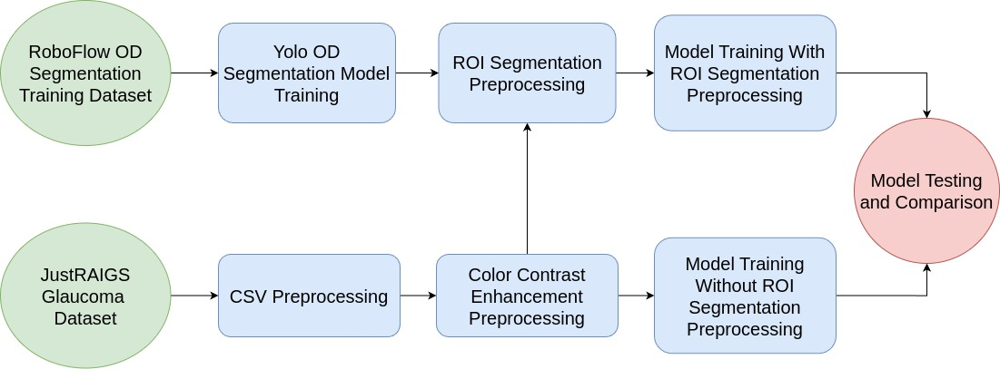
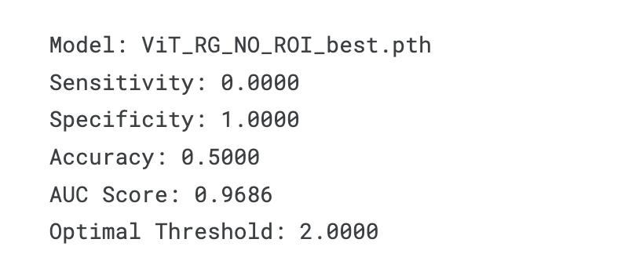
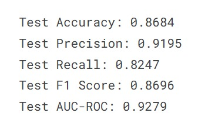
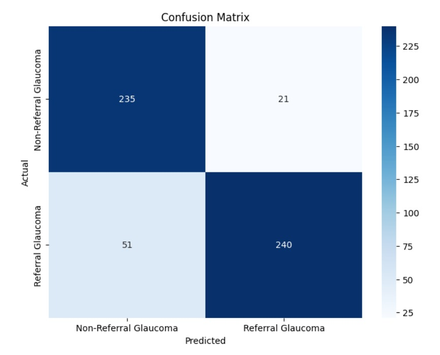

# Glaucoma Classification
### Group Members Group 7
- 21BDS008 - Ayush Jain
- 21BDS020 - Harsh Gupta
- 21BDS022 - Imroz Khan
- 21BDS065 - Sourish Joshi
- 21BDS066 - Tanmay Mahajan

Glaucoma is one of the leading causes of irreversible blindness and typically advances with no apparent symptoms until it progresses to cause obvious loss of vision. Its prevention from further progressing requires early detection using imaging methods such as color fundus photographs (CFPs). For example, CFPs are very important since they may have the capability to depict important aspects of glaucoma, including neuro-retinal rim thinning and optic disc hemorrhages.

The availability of such a large and critically annotated dataset for over 110,000 fundus photographs provides an important opportunity. This work outlines the main objective of developing a binary classification model between referable glaucoma and no-referable glaucoma. It would make automatic systems possible for early glaucoma detection that accelerates diagnostic efficiency and obviates preventable blindness.

## How to Run Inference Model

Follow the steps below to run the inference model on an eye fundus image and predict the label (Referable Glaucoma or Non-Referable Glaucoma).

1. **Download the Best Model Checkpoint**
   - Download the pre-trained model checkpoint from the following link:  
     [Click Here to Download](https://drive.google.com/file/d/1pj0MLKOF8q1Uq5kHPryduBHf1oizPCtY/view?usp=sharing)

2. **Update the Model Path**
   - Open the `inference-hda.ipynb` file.
   - Locate the variable `best_model_path` and replace its value with the local path where you downloaded the model checkpoint.

3. **Set the Image Path**
   - At the bottom of the last cell in the `inference-hda.ipynb` file, update the `img_path` variable with the path to the eye fundus image that you want to test.

4. **Run the Inference**
   - Execute the cells in the `inference-hda.ipynb` file to run the model.
   - The output will display the predicted label of the image as either **Referable Glaucoma** or **Non-Referable Glaucoma**.

By following these steps, you'll be able to use the trained model to make predictions on new eye fundus images.

## Dataset
The JustRAIGS dataset comprises over 110,000 carefully annotated fundus photographs from approximately 60,000 screenees. It includes a training subset of 101,442 gradable images and a test subset of 9,741 images, categorized into "referable glaucoma" and "no referable glaucoma." Due to resource limitations, our analysis focuses on a subset of this data: 2,623 images labeled as "referable glaucoma" and 5,110 images labeled as "no referable glaucoma." Each "referable glaucoma" image is further annotated with up to ten distinct glaucomatous features, making this dataset highly valuable for developing and evaluating AI algorithms for glaucoma screening.

## Methodology

## Preprocessing

### CSV Preprocessing
This section describes the steps performed for preprocessing the CSV data, which includes resolving labeling disagreements, downsampling the majority class, and splitting the dataset into training and testing sets.

### Steps:

1. **Loading the Data**
   - The dataset is loaded from a CSV file that contains labels and image paths using `pandas.read_csv()`.
   - The file path for this dataset is: `/kaggle/input/justraigs-with-paths/JustRAIGS_Train_labels_with_paths.csv`.

2. **Visualizing the Label Distribution**
   - The distribution of the final labels (`Final Label`) is analyzed by counting the occurrences of each label.
   - A bar plot is generated using `seaborn` to visualize the number of instances for each class (`Referable Glaucoma` (RG) and `Non-Referable Glaucoma` (NRG)).

3. **Downsampling the Majority Class (NRG)**
   - The function `downsample_majority_class()` is defined to balance the dataset by downsampling the majority class (NRG).
   - The NRG class is downsampled to match the desired ratio with the RG class. For example, a 2:1 ratio between RG and NRG is used in the example provided.
   - This function ensures that the training dataset has an equal or controlled distribution of both classes.

4. **Splitting the Dataset for Training and Testing**
   - The dataset is split into training and testing sets using `train_test_split()` from `sklearn.model_selection`.
   - Two separate splits are performed:
     - **Referable Glaucoma (RG)**: The RG instances are split into a training set (`train_rg`) and a test set (`test_rg`).
     - **Non-Referable Glaucoma (NRG)**: The NRG instances are split to ensure that the test set contains a balanced number of RG and NRG cases.
   - The training and testing sets are shuffled to ensure randomness.

5. **Saving the Processed Data**
   - The preprocessed training and testing sets are saved into CSV files for later use in model training and evaluation.
   - The following files are saved:
     - `glaucoma_no_mask_train.csv`: Contains the training data for the binary glaucoma classification.
     - `glaucoma_no_mask_test.csv`: Contains the testing data for the binary glaucoma classification.

### Color Contrast Enhancement
This section describes the image preprocessing steps that are applied to enhance the contrast and prepare the images for further analysis or model training. The preprocessing steps include contrast enhancement using CLAHE (Contrast Limited Adaptive Histogram Equalization), trimming margins, resizing the images while maintaining the aspect ratio, and saving the processed images to a new folder.

1. **Configuration**
   - The CSV files (`glaucoma_no_mask_train.csv` and `glaucoma_no_mask_test.csv`) are used to load the image paths for processing. These CSV files contain the paths to the retinal images that need to be preprocessed.
   - The processed images are saved to a directory (`/kaggle/working/preprocessed_images`) within the Kaggle environment.
   - The output image size is configurable via the `output_size` parameter, which is set to 2000 pixels in this case.

2. **Trimming Margins and Resizing**
   - The function `trim_and_resize()` is used to remove unnecessary margins from the images. This helps focus on the important parts of the image while discarding the irrelevant areas.
   - The trimming process works by converting the image to grayscale, creating a binary image, and finding rows and columns that contain more than 10% of the non-zero pixels (based on a threshold).
   - The image is then cropped to remove the empty borders based on the computed row and column sums.
   - After trimming, the image is resized to a specified output size while maintaining its aspect ratio. The image is resized using a high-quality Lanczos filter, and if necessary, the image is padded with a black border to meet the target size.

3. **CLAHE (Contrast Limited Adaptive Histogram Equalization) Enhancement**
   - The function `apply_clahe()` is used to enhance the contrast of each image by applying CLAHE on the individual color channels (Red, Green, and Blue).
   - CLAHE is an effective method to improve the contrast of retinal images, especially for images with uneven lighting conditions.
   - The image is first converted from RGB to BGR format (for compatibility with OpenCV), and CLAHE is applied to each channel separately.
   - After applying CLAHE, the channels are merged back and converted back to RGB.

4. **Processing and Saving Images**
   - A batch of images is processed by reading them from the specified paths, applying the CLAHE enhancement, trimming, and resizing.
   - The processed images are then saved to a specified output directory. If the image has already been processed and saved, it is skipped.
   - The output folder structure is created if it doesn't already exist. Each processed image is saved in the designated folder, and a progress bar is displayed during processing using `tqdm`.

The Color Contrast Preprocessing step enhances the quality of the retinal images by improving their contrast, trimming unnecessary margins, and resizing them to a consistent size. The images are then saved in a designated folder and can be uploaded to Kaggle as a dataset for further analysis or model training. This ensures that the images are properly prepared for downstream tasks, such as classification or segmentation models.

### Yolo OD Segmentation Model Training
The Dataset used to train YOLOv8 model for segmentation is taken from Roboflow. [Here](https://universe.roboflow.com/learn-through-experiments/glaucoma-detection-hhiwc/dataset/1)
This section describes how the YOLOv8 model is trained for Optic Disk (OD) segmentation using retinal images. The model is designed to detect and segment the optic disk region in fundus images, which is a key task in glaucoma detection.

1. **Preparing Label Files**
   - The first step involves updating the label files to ensure that the `class_id` for all instances is set to `0`, which corresponds to the optic disk class in the dataset. 
   - This is done for all label files in the training, validation, and test datasets (located in the `Glaucoma/train/labels`, `Glaucoma/valid/labels`, and `Glaucoma/test/labels` directories).
   - The class ID is manually updated to `0` for each bounding box in the label files, ensuring the dataset is ready for training with a consistent class labeling.

2. **Setting Up the YOLOv8 Model**
   - The YOLOv8 model architecture is selected based on the available hardware. A lightweight option, such as `yolov8n.yaml`, is used in this case.
   - The `ultralytics` package is used to load the YOLOv8 model, which is a state-of-the-art object detection model. The model is designed to detect various objects, including the optic disk, in images.

3. **Training the YOLOv8 Model**
   - The model is trained on the prepared dataset using the `YOLOv8` framework. The configuration includes setting the number of epochs, image size, and other hyperparameters. 
   - Training is performed on the dataset located in the `Glaucoma/data.yaml` file, which contains the paths to the images and the updated label files.
   - The training runs for 100 epochs, with images resized to 640x640 pixels during training.

4. **Saving the Model Weights**
   - After training is completed, the best-performing model is saved in the `weights/best.pt` file.
   - The trained model can now be used for inference on new images to detect the optic disk (OD) and perform segmentation.

The Yolo OD Segmentation Model Training section covers the steps for preparing the dataset, training a YOLOv8 model on retinal images for optic disk detection, and saving the best model checkpoint for future use. This model can be used for detecting the optic disk in fundus images, which is critical for diagnosing glaucoma.

### ROI Preprocessing Segmentation
After training the YOLOv8 model for optic disk (OD) segmentation, the next step is to perform ROI (Region of Interest) preprocessing. This involves using the trained model to detect and segment the optic disk in test images, followed by processing the detected regions for further analysis.

1. **Loading the Trained YOLOv8 Model**
   - The trained YOLOv8 model is loaded using the `ultralytics` library. The path to the trained model's weights is provided (`best.pt`), which contains the model that has been fine-tuned for optic disk detection.
   - The model is configured to run inference on new images, detecting the optic disk in each test image.

2. **Annotating and Saving the Results**
   - For each test image, the bounding boxes detected by the model are drawn on the image using OpenCV. 
   - The bounding boxes are drawn with green rectangles, and the class ID and confidence score are displayed as text on the image.

3. **ROI Preprocessing**
   - The bounding box coordinates for the optic disk are extracted from the inference results. These coordinates define the Region of Interest (ROI) in the image.
   - The processed images with the annotated bounding boxes can be used for further analysis or training other models for glaucoma detection or optic disk segmentation.

The ROI Preprocessing Segmentation section outlines the process of using a trained YOLOv8 model for detecting and segmenting the optic disk in test images. The detected regions are annotated, and the resulting images are saved for further use. This step is essential for evaluating the model's performance and extracting relevant features (optic disk) for downstream tasks.

## Training

### Training Preprocessing

The preprocessing steps for training the classification model involve several key transformations to ensure that the images are ready for input into the model. The main steps are:

1. **Resizing**:
   - All input images are resized to a consistent size of **384x384** pixels to standardize the input shape and ensure efficient batch processing during training.

2. **Data Augmentation**:
   - To enhance model robustness, **auto-augmentation** is applied during training. This uses the `AutoAugment` policy from the torchvision library, which randomly applies transformations such as rotations, flips, color jitter, and more.

3. **Normalization**:
   - The images are normalized to match the statistical properties of ImageNet data (used by pretrained models like ViT). This normalization uses the following mean and standard deviation values:
     - **Mean**: [0.485, 0.456, 0.406]
     - **Standard Deviation**: [0.229, 0.224, 0.225]

4. **Label Processing**:
   - Each image is labeled according to its "Final Label" from the provided CSV files (`glaucoma_masks_train.csv`), where:
     - `1` indicates "Referable Glaucoma (RG)"
     - `0` indicates "Non-Referable Glaucoma (NRG)"

   These labels are used for binary classification, with images corresponding to class `1` (RG) or `0` (NRG).

### Model Setup

We utilize the Vision Transformer (ViT) model (`vit_b_16`) pretrained on ImageNet as the base architecture for the classification task. The final classification layer is modified to output a **single probability** value for each image, corresponding to the likelihood of it being "Referable Glaucoma (RG)".

- **Freezing Layers**: All layers except the classification head are frozen to retain the knowledge learned from ImageNet during fine-tuning.
- **Loss Function**: We use **Binary Cross-Entropy (BCE)** loss with a class weight for the positive class (`RG`) to address the class imbalance. The class weight is calculated as the ratio of negative samples (`NRG`) to positive samples (`RG`).
  
### Data Loading and Training Loop

- **DataLoader**: The dataset is split into training and validation sets (80% training, 20% validation) using random splitting.
- **Training Process**: 
  - The model is trained for up to 100 epochs with early stopping if no improvement is seen in the validation AUC for 5 consecutive epochs.
  - The optimizer used is **AdamW**, and a learning rate scheduler helps fine-tune the model.

#### Metrics
Throughout the training process, key performance metrics including the AUC, F1 score, Precision, and Recall are monitored. These metrics provide a comprehensive understanding of the model’s performance and its predictive accuracy.

#### Visualizations
Training progress and results are visually represented through various charts, illustrating the dynamics of model training and validation. Below are the key visualizations:

     
  

  
  

---

## Testing

### Preprocessing

Similar to the training pipeline, **test-time preprocessing** ensures the model receives consistent input data. The following steps are applied to test images:

1. **Resizing**:
   - Test images are resized to **384x384** pixels, matching the input dimensions of the model.

2. **Normalization**:
   - The same **ImageNet normalization** is applied to test images to ensure they are scaled correctly for the pretrained ViT model.

3. **No Augmentation**:
   - Unlike the training phase, no data augmentation is performed during testing. This ensures that the model is evaluated on the original, unaltered images.

### Model Evaluation

The model is loaded from the **best saved checkpoint** from the training phase and is set to evaluation mode (`model.eval()`). Predictions are made by passing the test images through the model, and the output probabilities are used to classify images as either:
- **0** (Non-Referable Glaucoma, NRG)
- **1** (Referable Glaucoma, RG)

## Model Performance Metrics Comparison
We trained two models to classify eye fundus images into **Referable Glaucoma (RG)** and **Non-Referable Glaucoma (NRG)** classes:

1. **Model without ROI Preprocessed Dataset**:
   - The model was trained on the original dataset without any region-of-interest (ROI) preprocessing.
   - The model showed poor performance, often predicting only one class for all input images. This resulted in an accuracy of **50%** (random prediction of the two classes).

2. **Model with ROI Preprocessed Dataset**:
   - The second model was trained on a dataset where region-of-interest (ROI) preprocessing was applied.
   - This model showed a significant improvement, achieving an **accuracy of 86.84%**.

The two images below represent the performance metrics of the models trained on the two datasets:

  
   
  Metrics without ROI PreProcessing

  
   
  Metrics with ROI PreProcessing

### Final Confusion Matrix for the Model Trained with ROI Preprocessed Dataset

This confusion matrix highlights the number of true positives, true negatives, false positives, and false negatives, providing insights into the classification performance of the model.

---
